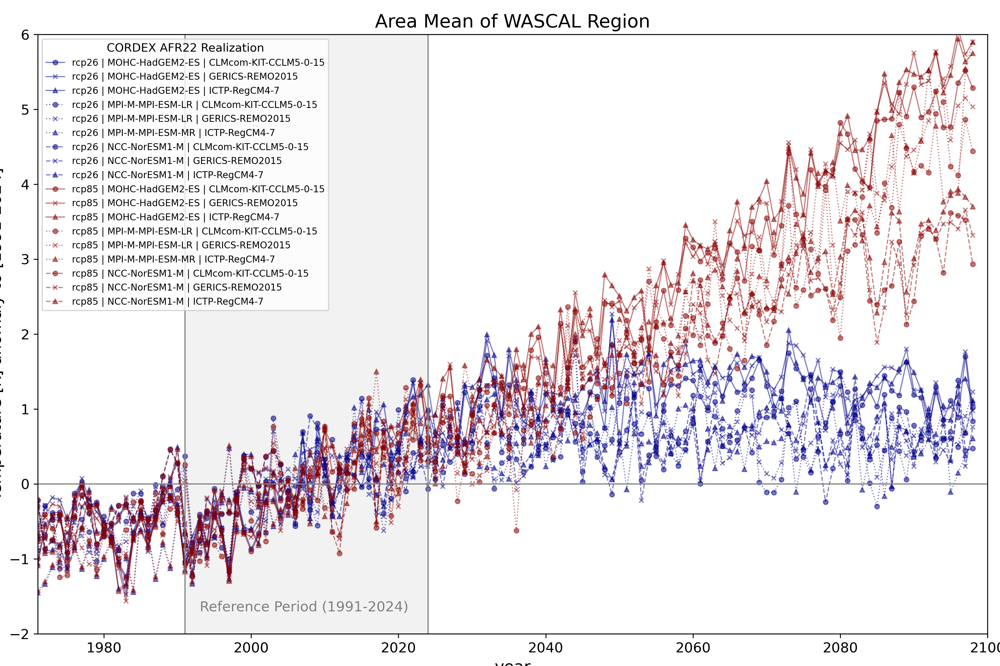

# Heat Indicators Africa

This repository documents the procedure, how the maps of climate heat indicator for africa on the basis of [CORDEX AFR-22](https://cordex.org/experiment-guidelines/cordex-cmip5/cordex-core/cordex-core-simulations/) data got developed.

### [Environment](ENVIRONMENT.md)

## Different heat indicators got calculated:

* Number of Heatdays for different temperature thresholds
* Heatwave frequency, maximum length and number of days in heatwaves
* Warm spell duration index

For the calculation [index_calculator](https://github.com/climate-service-center/index_calculator) is used. This is using [xclim](https://github.com/Ouranosinc/xclim)

### Time slices

Reference time period is 1981-2010.
	 

### Plotting horizontal maps:

If you like to plot the horizontal differences to the reference periode use

    Notebooks/horiplot-heat-indicator-diff-robust.ipynb
    Notebooks/plotting_tools_africa.py

### Plotting timeseries of area mean

Starting with implementing the [region](REGION.md) in climate fact data.
After calculation the area mean of the region,
you can plot with the following Notebook:

     Notebooks/timeseries_TG_WASCAL_for_bulletin.ipynb

