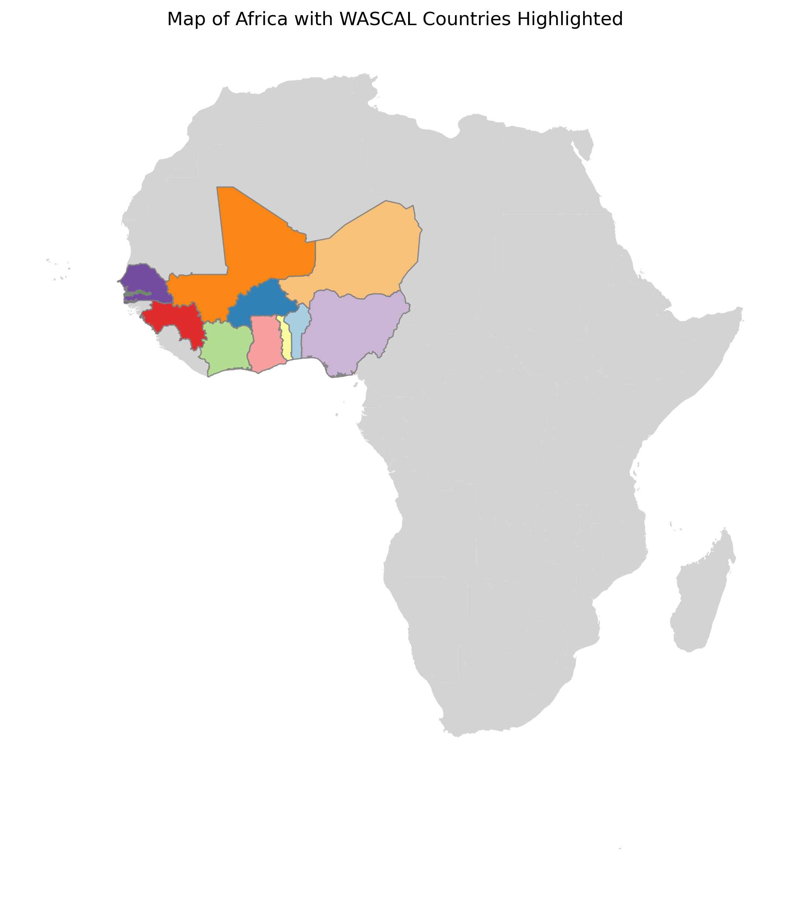

# Region

The country shape files will be read by [climate fact data](https://codebase.helmholtz.cloud/gerics_infrastructure/climate_fact_data).

Here are some Notebooks to explore the original shape file and make a big region, for example here are combined all WASCAL states to one region.

The final shape file should be put into this directory:

    ~/climate_fact_data/climate_fact_data/data/shp
## Notebook

    /home/g/g300047/SCRIPTS/github/heat-indicators-africa/Notebooks/read_nuts_2024_africa.ipynb

